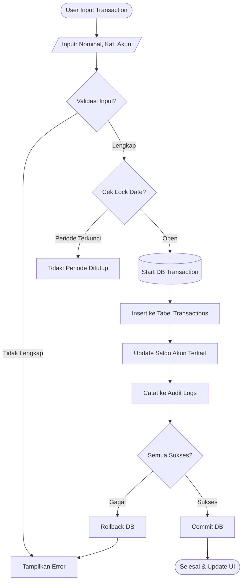
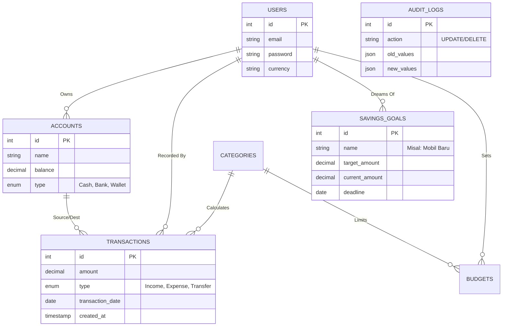

# ANALISIS DAN PERANCANGAN SISTEM: MAUNABUNG

## 1. Analisis Kompetitor

Bagian ini menguraikan hasil studi komparatif terhadap aplikasi sejenis untuk memahami lanskap pasar dan menetapkan posisi strategis Maunabung.

### 1.1. BukuWarung
*   **Fokus Utama**: Pembukuan UMKM, Manajemen Stok, dan Pembayaran Digital.
*   **Fitur Utama**:
    *   **Pembukuan Usaha**: Pencatatan utang piutang, pemasukan, dan pengeluaran harian.
    *   **Pengingat Utang Otomatis**: Fitur unggulan untuk menagih pelanggan via WhatsApp/SMS gratis.
    *   **Produk Digital (PPOB)**: Jualan pulsa, token listrik, dan pembayaran tagihan.
    *   **Pembayaran Digital**: Menerima pembayaran antar bank/E-Wallet bebas biaya admin (promo tertentu).
*   **Target Pengguna**: Pemilik warung, toko kelontong, pedagang pulsa, dan UMKM mikro yang membutuhkan solusi pembukuan sederhana namun lengkap.
*   **Model Monetisasi**: 
    *   Margin dari penjualan produk digital (PPOB).
    *   Biaya layanan pada fitur pembayaran/fintech tertentu.
    *   Solusi modal usaha (pinjaman).
*   **Kelebihan**: Sangat user-friendly untuk pemula, fitur pengingat utang sangat efektif mengurangi kredit macet, gratis tanpa biaya langganan.
*   **Kekurangan**: Fokus pada "jualan" dan bisnis, sehingga UI penuh dengan tawaran produk PPOB dan pinjaman. Kurang cocok untuk pengguna yang murni ingin mencatat keuangan pribadi (gaji/tabungan) karena *cluttered*.

### 1.2. Majoo
*   **Fokus Utama**: Aplikasi Wirausaha Lengkap (Point of Sales/Kasir).
*   **Fitur Utama**:
    *   **Sistem Kasir (POS)**: Manajemen order, meja (F&B), dan dapur.
    *   **Manajemen Inventori**: Stok bahan baku dan produk jadi.
    *   **Manajemen Karyawan**: Absensi dan komisi.
    *   **CRM & Promo**: Voucher dan poin member.
*   **Target Pengguna**: Bisnis F&B, Kafe, Ritel, Jasa (Skala Kecil - Menengah).
*   **Model Monetisasi**: Berlangganan (SaaS) mulai Rp129rb (Starter) hingga Rp999rb/bulan (Prime).
*   **Kelebihan**: Fitur sangat komprehensif, ekosistem hulu-ke-hilir (kasir sampai laporan laba rugi).
*   **Kekurangan**: Berbayar (tidak layak untuk personal use), kurva belajar tinggi, terlalu berat/kompleks untuk kebutuhan individu.

### 1.3. bukuPay
*   **Fokus Utama**: Infrastruktur Pembayaran Digital (Payment Gateway & QRIS).
*   **Fitur Utama**:
    *   **QRIS Speaker**: Notifikasi suara "Uang Masuk" untuk mencegah penipuan bukti bayar.
    *   **Pencairan Cepat**: Dana cair beberapa kali sehari.
    *   **Multi-toko**: Manajemen banyak outlet dalam satu aplikasi.
*   **Target Pengguna**: Merchant yang volume transaksinya tinggi dan butuh kecepatan verifikasi pembayaran.
*   **Model Monetisasi**: Penjualan perangkat keras (Speaker) dan MDR (Merchant Discount Rate) / biaya admin per transaksi. Tidak ada biaya langganan bulanan.
*   **Kelebihan**: Solusi spesifik untuk keamanan pembayaran, pencairan dana cepat.
*   **Kekurangan**: Fungsi pencatatan keuangan terbatas, lebih berfungsi sebagai alat terima uang daripada manajer aset.

### 1.4. Aplikasi Open-Source (Comparatives: Firefly III, GNUCash)
*   **Fokus Utama**: Manajemen Keuangan Pribadi (Personal Finance) dengan kendali penuh.
*   **Fitur Utama**:
    *   **Double-Entry Bookkeeping**: Standar akuntansi ketat.
    *   **Budgeting Canggih**: Amplop virtual (Piggy banks).
    *   **Self-Hosted**: Data disimpan di server sendiri.
*   **Target Pengguna**: Tech-savvy user, privacy enthusiast, dan mereka yang butuh audit trail detail.
*   **Model Monetisasi**: Gratis (Community Driven / Donasi).
*   **Kelebihan**: Privasi total, tanpa iklan, fitur sangat mendalam dan bisa dikustomisasi.
*   **Kekurangan**: Instalasi sangat teknis (butuh Docker/Server), UX seringkali kaku ("banyak form"), tidak ada mobile app *native* resmi yang mulus.

---

## 2. Identifikasi Keunggulan Kompetitif (UVP)

Maunabung diposisikan sebagai **"Personal Finance Guardian"** yang mengisi celah antara *pencatatan manual yang rentan error* dan *software akuntansi bisnis/ERP yang terlalu kompleks*.

### Unique Value Proposition (UVP)
> *"Satu-satunya Aplikasi Keuangan Pribadi yang Menerapkan Akuntansi Double-Entry Tanpa Memaksa Anda Menjadi Akuntan."*

1.  **Strict Double-Entry Lite**: Menjamin saldo di aplikasi *pasti* sama dengan uang nyata. Jika ada selisih, sistem memaksa "Adjustment Transaction" daripada sekadar edit saldo diam-diam. Validitas data adalah prioritas #1.
2.  **Zero-Bloat & Privacy First**: Tidak seperti BukuWarung (banyak iklan pinjaman) atau Majoo (fitur bisnis berat), Maunabung didesain **Khusus Individu**: Bersih, Cepat, Tanpa Iklan, dan Data Lokal (Self-Hosted option).
3.  **Goal-Oriented Simulation**: Tidak sekadar mencatat masa lalu (expense tracking), tapi membantu merencanakan masa depan (savings goal & salary allocation).

### Perbedaan Signifikan
| Aspek | Aplikasi UMKM (BukuWarung/Majoo) | Aplikasi Expense Tracker Biasa | **Maunabung** |
| :--- | :--- | :--- | :--- |
| **Logika** | Single/Double Entry (Business Logic) | Single Entry (Hanya Catat) | **Double Entry Lite (Validasi)** |
| **Data** | Cloud (Milik Vendor) | Cloud/Lokal | **Lokal/Self-Hosted (Milik User)** |
| **Fokus** | Operasional Bisnis & Jualan | Mencatat Pengeluaran | **Kesehatan Finansial & Target** |
| **Monetisasi**| Iklan Pinjaman / Langganan | Iklan / Freemium | **Gratis / Open Source** |
| **User Exp.**| Ramai (Iklan/Menu Jualan) | Simpel | **Modern, Fokus, Tenang** |

---

## 3. Analisis Gap & Permasalahan Pengguna

### Kebutuhan yang Belum Terpenuhi
1.  **"Salary Sorting" Anxiety**: Pengguna milenial sering bingung *begitu gajian masuk rekening, uang ini harus dibagi berapa untuk makan, kos, dan nabung?*. Aplikasi lain hanya mencatat *setelah* uang keluar, bukan merencanakannya saat masuk.
2.  **Simulasi Mimpi (Dream Calc)**: Pengguna ingin jawaban instan: *"Kalau saya nabung Rp500rb/bulan mulai sekarang, kapan saya bisa beli iPhone 15 seharga Rp16jt?"*.
3.  **Koreksi Saldo Tanpa "Tipu-Tipu"**: Di aplikasi tracker biasa, jika saldo di HP beda dengan di Dompet, user tinggal edit angka saldo. Ini buruk karena menghilangkan jejak kemana uang itu hilang. Maunabung mengharuskan kejujuran: selisih harus dicatat sebagai "Penyesuaian (Lost/Found)".

### Solusi Dampak Tinggi (Sederhana)
*   **Fitur "Gajian Manager"**: Satu layar khusus saat input Pemasukan Gaji, di mana user bisa langsung memecah nominal tersebut ke beberapa "Amplop Virtual" (Misal: 50% Kebutuhan, 30% Keinginan, 20% Tabungan).
*   **Fitur "Dream Simulator"**: Input (Harga Barang, Target Tanggal) -> Output (Harus Nabung Berapa per Bulan). Atau sebaliknya.
*   **Fitur "Audit Forensik"**: User bisa melihat *siapa* dan *kapan* data diubah. Penting untuk transparansi diri sendiri.

---

## 4. Fitur Rekomendasi & Studi Kasus

### A. Fitur Rekomendasi Alokasi Gaji (The 50/30/20 Rule)
**Kasus**: User dengan Gaji Rp 5.000.000/bulan.
**Sistem**: Saat user input transaksi "Pemasukan: Gaji", sistem menawarkan tombol **"Bantu Alokasikan"**.
*   **Needs (50%)**: Rp 2.500.000 -> Masuk ke Budget Makan & Tagihan.
*   **Wants (30%)**: Rp 1.500.000 -> Masuk ke Budget Hiburan/Belanja.
*   **Savings (20%)**: Rp 1.000.000 -> Ditransfer otomatis (secara pencatatan) ke Akun "Tabungan Utama".

**Value**: Mengedukasi user tentang disiplin finansial tanpa menggurui.

### B. Fitur Simulasi Target (Savings Goal Simulator)
**Kasus**: User ingin membeli Laptop Gaming seharga Rp 15.000.000.
**Input User**:
*   Target: Rp 15.000.000
*   Kondisi A (Time Bound): "Saya butuh barang ini dalam 10 bulan." -> **Sistem**: "Kamu harus nabung **Rp 1.500.000/bulan**."
*   Kondisi B (Budget Bound): "Saya cuma sanggup nabung Rp 500.000/bulan." -> **Sistem**: "Kamu baru bisa beli laptop ini dalam **30 bulan (2,5 tahun)**."

**Value**: Memberikan ekspektasi realistis dan motivasi visual (Progress Bar).

---

## 5. Pendekatan Analisis Sistem

Sebelum masuk ke tahap implementasi kode, sangat penting untuk memetakan logika sistem secara manual untuk memastikan validitas alur akuntansi.

### 5.1. Analisis Kebutuhan (Requirements)

#### A. Kebutuhan Fungsional (User Side)
1.  **Fungsi Pencatatan**: User harus bisa mencatat Pemasukan, Pengeluaran, dan Transfer.
2.  **Fungsi Validasi**: Sistem harus menolak transaksi yang tidak seimbang atau melanggar constraint (misal: transfer dari akun yang tidak valid).
3.  **Fungsi Rekonsiliasi**: User harus bisa menyesuaikan saldo nyata dengan saldo sistem melalui mekanisme audit (Adjustment Transaction).
4.  **Fungsi Simulasi**: User harus bisa membuat target tabungan (`savings_goals`) dan melihat estimasi waktu pencapaian.

#### B. Kebutuhan Non-Fungsional (System Side)
1.  **Kepatuhan ACID**: Database harus mendukung transaksi atomik (InnoDB) untuk mencegah data korup.
2.  **Presisi Desimal**: Perhitungan uang wajib menggunakan `BCMath` atau tipe data `DECIMAL` di database, bukan FLOAT.
3.  **Keamanan Data**: Enkripsi pada kolom sensitif (audit logs) dan proteksi XSS/CSRF.
4.  **Integritas Relasional**: Constraint `Foreign Key` harus ketat (`ON DELETE RESTRICT` untuk akun dengan saldo).

### 5.2. Perancangan Alur Sistem (Flowchart)

Berikut adalah logika alur data untuk fitur inti **"Catat Transaksi Aman"**:

### 5.3. Perancangan Database & ERD

Diagram berikut menggambarkan hubungan antar entitas utama dalam sistem Maunabung.

### 5.4. Tabel Data & Struktur Informasi

Berdasarkan skema database saat ini (`schema.sql`), tabel `savings_goals` sudah tersedia dengan struktur:
| Kolom | Tipe Data | Keterangan |
| :--- | :--- | :--- |
| `id` | INT (PK) | Auto Increment |
| `user_id` | INT (FK) | Pemilik Goal |
| `name` | VARCHAR | Judul Tabungan |
| `target_amount` | DECIMAL(15,2) | Target Nominal |
| `current_amount`| DECIMAL(15,2) | Saldo Terkumpul |
| `deadline` | DATE | Tanggal Target |

### 5.5. Validasi Logika & Skenario Penggunaan

**Skenario: Alokasi Gaji ke Tabungan Impian**
1.  **User Action**: Menerima Gaji Rp 5.000.000.
2.  **System Check**:
    *   Catat **Income** Rp 5.000.000 ke Akun "Bank BCA".
    *   (Otomatis/Manual) User pilih "Alokasi ke Goal: Beli Laptop" sebesar Rp 1.000.000.
3.  **Logic Execution**:
    *   Sistem tidak memindahkan uang fisik, tapi memindahkan "alokasi mental".
    *   **Opsi A (Virtual)**: Update `current_amount` di `savings_goals` (+1jt). Saldo Bank BCA tetap 5jt, tapi *Free Cash* tinggal 4jt.
    *   **Opsi B (Segregated)**: Buat transaksi Transfer dari "Bank BCA" ke Akun "Tabungan Laptop". Saldo BCA berkurang jadi 4jt.

---

## 6. Dokumentasi & Penutup

Seluruh hasil analisis ini menjadi dasar bagi tim pengembang untuk memastikan setiap baris kode yang ditulis memiliki landasan logis yang kuat.

*   **Versi Dokumen**: 1.0.0
*   **Status**: Final Draft
*   **Tanggal**: 18 Desember 2025
